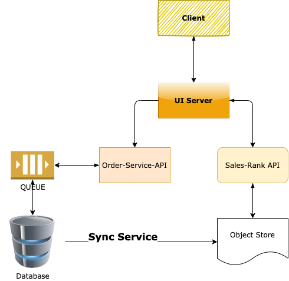
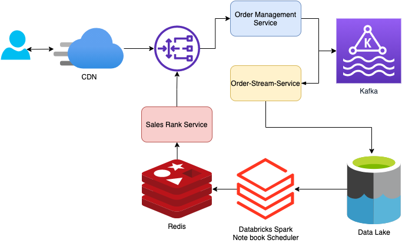

# Top Selling Product for a given category

### Use Cases:

- Expose a service which returns top selling products for a given product category.

### Assumptions/Constraints:

- Products can be in multiple categories.

- Products don't change categories once setup.

- Categories are only one level, there are no sub-categories.

- Hourly sales report is generated in a CSV format and placed in dropbox location every hour. The file name is of format SalesReport-YYYYMMDDHH.csv.

- Assume a suitable schema for sales feed.

- Only design this service and not the entire ecommerce system.

### Load characteristics:

- 100 million products.

- 1000 categories.

- 1 billion sales per month.

- 10K TPS for top-selling-products API.

### High Level Design:

- Draw a high level architecture.

- Draw a high level deployment architecture (can be combined with above).

  _The independent services would be dockerized and deployed through kubernetes cluster so as to provide auto scaling while we have high load._

- Draw the key data flows.

  _The application would be behind an application gateway with reverse proxy enabled. Azure application gateway is an example for this_

  

### Low Level Design:

- Object Model that covers the main entities and their interactions for the component processing sales feed every hour.

#### Sales Feed Api

The _Order-Mangement Service_ would get the request from UI and publish the order into Kafka. Further, it could be posted into a Relational database for managin the order details along with the Further, the _order-stream service_ would listen to the kafka topic and put the data into a S3 bucket or azure datalake.

[Kafka Connect to S3](https://www.youtube.com/watch?v=_RdMCc4HGPY)
[Kafka stream to s3 open source](https://github.com/lensesio/stream-reactor/tree/master/kafka-connect-aws-s3)

The order-stream api would log into s3 as follows:

```
timestamp   product_id  category_id    qty     total_price   customer_id
t1          product1    category1      2       120.00         1
t2          product1    category2      2       320.00         2
t2          product1    category2      1       140.00         3
t3          product2    category1      3        97.00         4
t4          product3    category2      7        12.00         5
t5          product4    category1      1        95.00         6
t6          product1    category2     -1       140.00         3
...
```

- Object Model that covers the main entities and their interactions for the component handling the top-selling-products service requests.

  _A databricks workspace could be used here to do the big data aggregation to do the query to group products sold by category and write into redis cluster. The databricks provides a job scheduler or else we could schedule this notebook with Azure datafactory or airflow systems to write every hour into redis cluster_

  [Databricks mount point for s3](https://docs.databricks.com/data/data-sources/aws/amazon-s3.html)

Sample code for connecting databricks to s3:

```
aws_bucket_name = "<aws-bucket-name>"
mount_name = "<mount-name>"
dbutils.fs.mount("s3a://%s" % aws_bucket_name, "/mnt/%s" % mount_name)
display(dbutils.fs.ls("/mnt/%s" % mount_name))
```

```
%python

dict2 = [{"product_id":123, "category_id":47326, "qty":5},{"product_id":1234, "category_id":47326, "qty":5}, {"product_id":123, "category_id":47326, "qty":10}, {"product_id":22, "category_id":47325, "qty":10}, {"product_id":12, "category_id":474326, "qty":10}, {"product_id":12, "category_id":473326, "qty":40}, {"product_id":12, "category_id":47326, "qty":10}]

rdd2=sc.parallelize(dict2)
df2=rdd2.toDF()
print("Printing the dataframe df1")
df2.show()
```

```
%python

import pyspark.sql.functions as F

@F.pandas_udf('string', F.PandasUDFType.GROUPED_AGG)
def collect_list(id):
    return ', '.join(str(id))

df2.createOrReplaceTempView("Sales")
df3 = spark.sql("select category_id, product_id, qty, dense_rank() over (partition by category_id order by qty desc) as rank from (select category_id, product_id, sum(qty) as qty from Sales group by category_id, product_id) mytable group by category_id, product_id, qty ")

df3.show()
df4 = df3.groupBy("category_id").agg(collect_list("product_id").alias("product_id"))

df4.show()

```


- Rest API design for the top-selling-products (cover resource, actions, URI params, HTTP codes etc).

- DB Schema details (if any).

- Technology choices.



Additional Questions to answer:

- How do you scale the system for the specified load characteristics?

- How do you make sure the system can perform at <500 ms latency for 99th %tile of requests.

- How do you make sure the system is built for hourly update of top-products results.

- How do you debug and monitor this service for failures?

- How will you integrate with product sellers and to periodically tell them their product sales rank. Will they pull, or you push?
